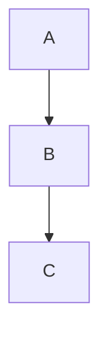

# gsd-pi-mermaid extension

A gsd-pi community extension that wires the 7 `mermaid-tui-mcp` stdio MCP tools
into gsd-pi **without going through the broken `mcp_call` transport**.

## Why this exists

The default gsd-pi MCP transport (the `mcp-client` extension backed by
`@modelcontextprotocol/sdk` 1.29.0) double-escapes the `code` argument when
relaying a `tools/call` request. For multi-line Mermaid source like:



…the server receives the string `graph TD\n  A --> B\n  B --> C` (literal
backslashes) instead of a string with real newlines. The Mermaid 11 parser
then chokes on the single-line input. Verified independently: a direct
stdio roundtrip with the same JSON-RPC payload succeeds.

This extension bypasses the broken transport by spawning the mermaid server
as a long-lived child process and exchanging **raw JSON-RPC over stdio** —
the same wire format the server uses, with no intermediate SDK re-serialization.
Real newlines survive.

## Tools

| Tool | Calls mermaid-tui-mcp tool | Returns |
|------|---------------------------|---------|
| `mermaid_render` | `render_mermaid` | `{ id, ascii, fileLink, httpLink, title, warnings, elapsed_ms }` |
| `mermaid_pin` | `pin_mermaid` | `{ id, pinned: true, elapsed_ms }` |
| `mermaid_unpin` | `unpin_mermaid` | `{ id, pinned: false, elapsed_ms }` |
| `mermaid_get` | `get_diagram` | `{ id, title, code, ascii, svg, …, sourceLength }` |
| `mermaid_list` | `list_diagrams` | `{ items, nextCursor }` (paginated) |
| `mermaid_search` | `search_diagrams` | `{ items, nextCursor }` with `titleMatch` + `snippet` |
| `mermaid_delete` | `delete_mermaid` | `{ id, deleted: true }` (NOT idempotent — verifies before deleting) |

The tool parameter shapes mirror the underlying mermaid-tui-mcp tools 1:1.

## Install (global, per-user)

Copy this directory to `~/.pi/agent/extensions/mermaid-direct/`:

```bash
# from inside the mermaid-tui-mcp repo
mkdir -p ~/.pi/agent/extensions
cp -r extensions/gsd-pi-mermaid ~/.pi/agent/extensions/mermaid-direct

# then /reload in gsd-pi
```

## Install (project-local, not committed to mermaid-tui-mcp)

If you don't want to commit a copy of the extension in your mermaid checkout,
add a project-local symlink or a settings.json entry that points at this
directory. (Exact mechanism depends on your gsd-pi version's
`extensions` config key — see gsd-pi docs.)

## Configuration

| Env var | Default | Purpose |
|---------|---------|---------|
| `MERMAID_SERVER_PATH` | `<projectRoot>/src/server.mjs` (where `projectRoot` is `PI_PROJECT_DIR` or `process.cwd()`) | Absolute path to the mermaid server entrypoint |
| `PI_PROJECT_DIR` | (set by gsd-pi per session) | Project root; the default `MERMAID_SERVER_PATH` is computed from this |
| All `MERMAID_RENDERER_*` and `MERMAID_OSS_*` env vars | inherited from the gsd-pi process | Forwarded verbatim to the spawned server (so `MERMAID_RENDERER_DATA`, `MERMAID_OSS_ENDPOINT`, etc. work as if you ran the server directly) |

The server is spawned **once** on the first tool call and reused across all
subsequent tool calls in the session. The child process is closed on
`session_shutdown`.

## Architecture

```
┌──────────────────┐  raw JSON-RPC over stdio  ┌──────────────────────┐
│  gsd-pi tool     │ ◀────────────────────────▶ │  node src/server.mjs │
│  (mermaid_render │                            │  (mermaid-tui-mcp)   │
│   wraps a thin   │  spawn on first call,     │                      │
│   pass-through)  │  reused thereafter         │                      │
└──────────────────┘                            └──────────────────────┘
        ▲
        │  MermaidClient (long-lived child process, request/response queue)
        │
        ▼
  extensions/gsd-pi-mermaid/
    MermaidClient.ts   ← pure Node, no gsd-pi deps, unit-testable
    index.ts           ← gsd-pi entrypoint, registers 7 tools
    extension-manifest.json
```

`MermaidClient.ts` has zero gsd-pi imports — it can be unit-tested with plain
Node and a live mermaid server. The gsd-pi-specific glue lives only in
`index.ts`.

## Limitations

- **One mermaid server per gsd-pi session.** If you want a second server
  (e.g. for a second project), spawn a new gsd-pi session with a different
  `PI_PROJECT_DIR` (or `MERMAID_SERVER_PATH`).
- **No tool result stream chunking.** The mermaid server's `tools/call`
  returns a single `content[0].text` JSON envelope per call. The extension
  surfaces the full envelope to the LLM (truncated to the standard 50KB
  / 2000-line gsd-pi cap).
- **No auto-reconnect on child crash.** If the spawned server dies, the
  next tool call throws. A future improvement: detect `child.on("exit")`
  and clear `initPromise` so the next call re-spawns.

## Testing

```bash
# unit-test the MermaidClient (no gsd-pi required)
node tests/unit/extensions/gsd-pi-mermaid-client.test.mjs

# end-to-end inside gsd-pi (after install)
# 1. start a gsd-pi session with this extension loaded
# 2. ask the LLM: "show me a flowchart of the OAuth2 authorization-code flow"
# 3. confirm the LLM calls mermaid_render and returns the ASCII + fileLink
```

## Why this isn't a gsd-pi upstream PR

The bug is real and should be fixed in gsd-pi's mcp-client (or in
`@modelcontextprotocol/sdk` 1.29.0). Filing an issue / PR upstream is the
right long-term fix. This extension is the **scoped, project-local
workaround** that ships now without depending on an upstream release cycle.
